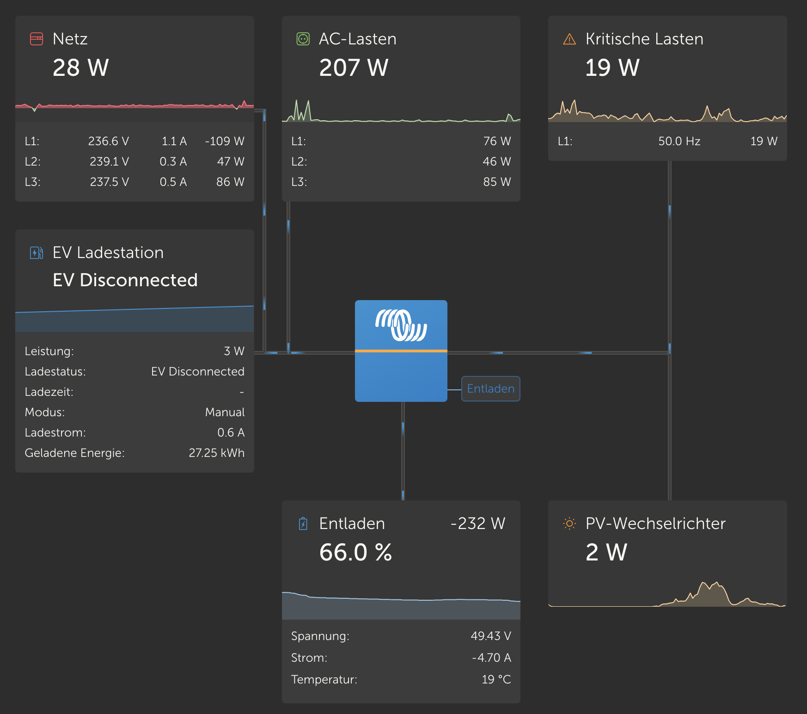

# dbus-TeslaWallConnector
Integrate Tesla Wall Connector into Victron Energies Venus OS

# BETA Status
There still might be some issues

## Purpose
This repo enable visualizing data of one Tesla Wall Connector VenusOS and GX devices from Victron.
Idea is inspired on @fabian-lauer, @viktorm and @trixing project linked below, many thanks for sharing the knowledge:
- https://github.com/fabian-lauer/dbus-shelly-3em-smartmeter
- https://github.com/trixing/venus.dbus-twc3
- https://github.com/vikt0rm/dbus-goecharger

## How it works
### My setup (only relevant for this script)
- 3-Phase installation
- Venus OS on Cerbo GX - Firmware v3.30
- Tesla Wall Connector hardware version 3
  - needs to be in the same network as the cerbo (a static ip needs to be condigured if you can not reach the Wall Connector via "TeslaWallConnector.local")

### Details / Process
What is the script doing:
- Running as a service
- connecting to DBus of the Venus OS `com.victronenergy.evcharger.http_{DeviceInstanceID_from_config}`
- After successful DBus connection the Tesla Wall Connector is accessed via REST-API
  - http://ip_of_connector/api/1/vitals
  - http://ip_of_connector/api/1/lifetime
  - http://ip_of_connector/api/1/version
 
  currently not used
  - http://ip_of_connector/api/1/wifi_status
- Serial/MAC is taken from the response as device serial
- Paths are added to the DBus with default value 0 - including some settings like name, etc
- After that a "loop" is started which pulls Tesla Wall Connector data every 2.5s from the REST-API and updates the values in the DBus


### Restrictions
This script until now supports reading values from the Tesla Wall Connector. Writing values is not supported as there is currently no known API. 
Control of Tesla Wall Connector by the victron system in "Mode" "Auto" is not supported for now and changing the value will have no effect.


### Pictures


## Install & Configuration
### Get the code


Log into your GX device via ssh and run the following scripts:
```
wget https://github.com/Sonny13/dbus-TeslaWallConnector/archive/refs/heads/main.zip
unzip main.zip "dbus-TeslaWallConnector-main/*" -d /data
mv /data/dbus-TeslaWallConnector-main /data/dbus-teslawallconnector
chmod a+x /data/dbus-teslawallconnector/install.sh
rm main.zip
```

### Change config.ini
Within the project there is a file `/data/dbus-teslawallconnector/config.ini` - just change the values - most important is the deviceinstance under "DEFAULT" and host in section "ONPREMISE". More details below:

| Section  | Config vlaue | Explanation |
| ------------- | ------------- | ------------- |
| DEFAULT  | AccessType | Fixed value 'OnPremise' |
| DEFAULT  | SignOfLifeLog  | Time in minutes how often a status is added to the log-file `current.log` with log-level INFO |
| DEFAULT  | Deviceinstance | Unique ID identifying the shelly 1pm in Venus OS |
| ONPREMISE  | Host | IP or hostname of Tesla Wall Connector |


```
nano /data/dbus-teslawallconnector/config.ini
```

### Start the Service

```
/data/dbus-teslawallconnector/install.sh
```
⚠️ Check configuration after that - because service is already installed an running and with wrong connection data (host) you will spam the log-file

## Debugging

### Check if the script is running

```svstat /service/dbus-teslawallconnector``` 
show if the service (our script) is running. If the number of seconds shown is low, it is probably restarting and you should look into ```cat /data/dbus-teslawallconnector/current.log```.


### Restart
you can restart the service after a config change with

```
/data/dbus-teslawallconnector/restart.sh
```

### Stop / Uninstall
you can stop the service 

```
/data/dbus-teslawallconnector/uninstall.sh
```


